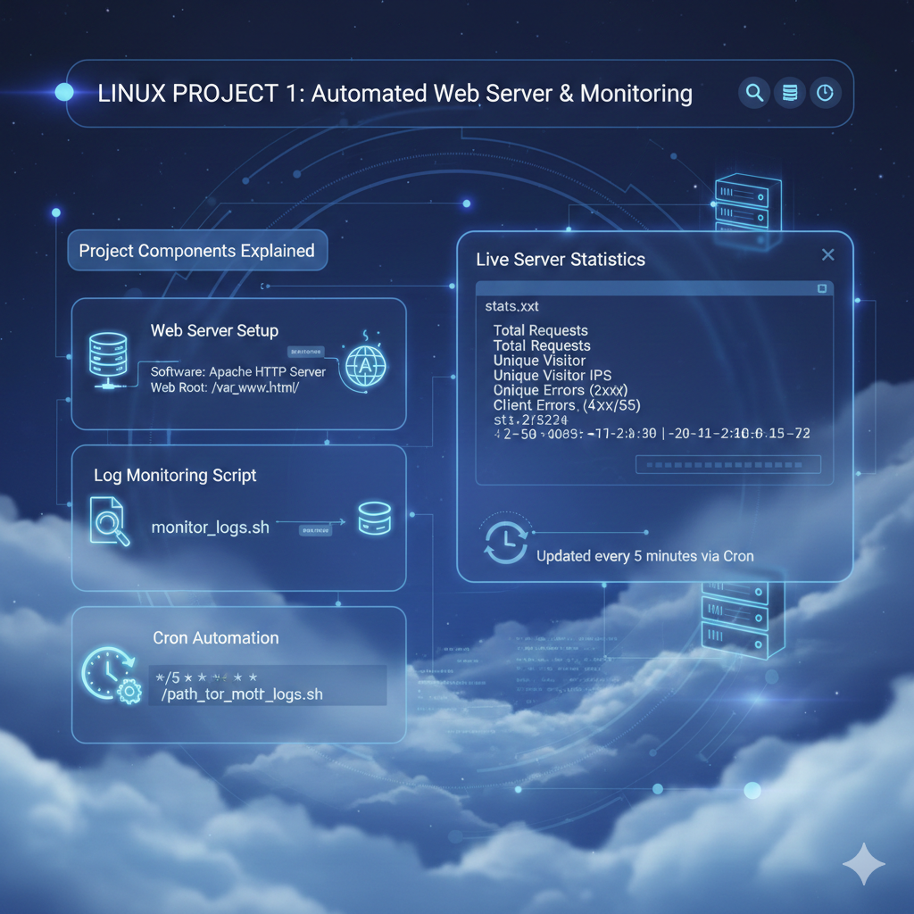

# Linux Log Monitoring Project  
A simple but powerful Linux automation project built on **AWS EC2**, **Nginx**, **Shell Scripting**, and **Cron Jobs**.  
The system analyzes Nginx access logs, detects errors, and updates a live webpage every 1 minute.

---

## 🚀 Project Overview
This project demonstrates how server-side monitoring works in a Linux environment.  
It includes:

- Hosting a webpage on **Nginx**  
- Parsing Nginx access logs using a **shell script**  
- Tracking:
  - Total “error” lines
  - Total HTTP **500** responses  
- Exporting monitoring results to a **web-accessible log file**  
- Automating everything using **Cron (every 1 minute)**  
- Displaying results on a **simple, clean webpage**

---

## 🛠️ Technologies Used
| Component | Purpose |
|----------|---------|
| **AWS EC2 (Amazon Linux 2023)** | Cloud server hosting |
| **Nginx** | Web server + log source |
| **Bash Script** | Log monitoring logic |
| **Cron Job** | Automation (1-minute interval) |
| **HTML/CSS/JS** | Log viewer webpage |

---

## 📁 Project Structure
